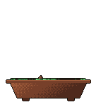

<a href="https://git.io/typing-svg">
  <picture>
    <source media="(prefers-color-scheme: dark)" srcset="https://readme-typing-svg.demolab.com?font=Space+Mono&amp;weight=700&amp;size=20&amp;duration=2500&amp;pause=700&amp;color=C9A7FF&amp;background=00000000&amp;vCenter=true&amp;width=430&amp;height=50&amp;lines=Greetings%2C+fellow+explorer!;Welcome+to+my+digital+space." />
    
  </picture>
</a>

<em>
I am an embedded systems enthusiast with a passion for electronics spanning both hardware and software. I enjoy crafting innovative things and see them come to life, develop, and evolve. Beyond embedded systems, I’m drawn to creating apps and other solutions that help people solve real problems, with creativity and thoughtful architecture guiding everything I build.   On a mission to grow and slither toward success, one commit at a time.
</em>

<em>
Sincerely, <strong>Abu Jaber, Muna</strong>
</em>

 

  
  

  <a href="https://github.com/egorthinks/git-bonsai">
    <picture>
      <source media="(prefers-color-scheme: dark)" srcset="https://img.shields.io/badge/Grown_with-git--bonsai-C9A7FF" />
      
    </picture>
  </a>
  <a href="https://github.com/dahan8473/snake-and-commits">
    <picture>
      <source media="(prefers-color-scheme: dark)" srcset="https://img.shields.io/badge/Made_with-snake--and--commits-C9A7FF" />
      
    </picture>
  </a>

<a href="https://git.io/typing-svg">
  <picture>
    <source media="(prefers-color-scheme: dark)" srcset="https://readme-typing-svg.demolab.com?font=Space+Mono&amp;weight=300&amp;size=20&amp;duration=2500&amp;pause=700&amp;color=F0F6FC&amp;background=00000000&amp;vCenter=true&amp;width=430&amp;height=50&amp;lines=Embedded+Toolkit" />
    
  </picture>
</a>

  <picture>
    <source media="(prefers-color-scheme: dark)" srcset="https://img.shields.io/badge/C-C9A7FF?style=flat-square" />
    
  </picture>
  <picture>
    <source media="(prefers-color-scheme: dark)" srcset="https://img.shields.io/badge/C%2B%2B-C9A7FF?style=flat-square" />
    
  </picture>
  <picture>
    <source media="(prefers-color-scheme: dark)" srcset="https://img.shields.io/badge/Python-C9A7FF?style=flat-square" />
    
  </picture>
  <picture>
    <source media="(prefers-color-scheme: dark)" srcset="https://img.shields.io/badge/STM32-C9A7FF?style=flat-square" />
    
  </picture>
  <picture>
    <source media="(prefers-color-scheme: dark)" srcset="https://img.shields.io/badge/STM32Cube-C9A7FF?style=flat-square" />
    
  </picture>
  <picture>
    <source media="(prefers-color-scheme: dark)" srcset="https://img.shields.io/badge/STM32_HAL-C9A7FF?style=flat-square" />
    
  </picture>
  <picture>
    <source media="(prefers-color-scheme: dark)" srcset="https://img.shields.io/badge/FreeRTOS-C9A7FF?style=flat-square" />
    
  </picture>
  <picture>
    <source media="(prefers-color-scheme: dark)" srcset="https://img.shields.io/badge/ROS-C9A7FF?style=flat-square" />
    
  </picture>
  <picture>
    <source media="(prefers-color-scheme: dark)" srcset="https://img.shields.io/badge/micro--ROS-C9A7FF?style=flat-square" />
    
  </picture>
  <picture>
    <source media="(prefers-color-scheme: dark)" srcset="https://img.shields.io/badge/UART-C9A7FF?style=flat-square" />
    
  </picture>
  <picture>
    <source media="(prefers-color-scheme: dark)" srcset="https://img.shields.io/badge/SPI-C9A7FF?style=flat-square" />
    
  </picture>
  <picture>
    <source media="(prefers-color-scheme: dark)" srcset="https://img.shields.io/badge/I2C-C9A7FF?style=flat-square" />
    
  </picture>
  <picture>
    <source media="(prefers-color-scheme: dark)" srcset="https://img.shields.io/badge/BLDC_Motor_Control-C9A7FF?style=flat-square" />
    
  </picture>
  <picture>
    <source media="(prefers-color-scheme: dark)" srcset="https://img.shields.io/badge/PWM-C9A7FF?style=flat-square" />
    
  </picture>
  <picture>
    <source media="(prefers-color-scheme: dark)" srcset="https://img.shields.io/badge/PCB_Design-C9A7FF?style=flat-square" />
    
  </picture>
  <picture>
    <source media="(prefers-color-scheme: dark)" srcset="https://img.shields.io/badge/KiCad-C9A7FF?style=flat-square" />
    
  </picture>
  <picture>
    <source media="(prefers-color-scheme: dark)" srcset="https://img.shields.io/badge/MATLAB-C9A7FF?style=flat-square" />
    
  </picture>
  <picture>
    <source media="(prefers-color-scheme: dark)" srcset="https://img.shields.io/badge/Simulink-C9A7FF?style=flat-square" />
    
  </picture>
  <picture>
    <source media="(prefers-color-scheme: dark)" srcset="https://img.shields.io/badge/VHDL-C9A7FF?style=flat-square" />
    
  </picture>
  <picture>
    <source media="(prefers-color-scheme: dark)" srcset="https://img.shields.io/badge/SystemVerilog-C9A7FF?style=flat-square" />
    
  </picture>
  <picture>
    <source media="(prefers-color-scheme: dark)" srcset="https://img.shields.io/badge/FPGA-C9A7FF?style=flat-square" />
    
  </picture>
  <picture>
    <source media="(prefers-color-scheme: dark)" srcset="https://img.shields.io/badge/Vivado-C9A7FF?style=flat-square" />
    
  </picture>
  <picture>
    <source media="(prefers-color-scheme: dark)" srcset="https://img.shields.io/badge/Quartus-C9A7FF?style=flat-square" />
    
  </picture>
  <picture>
    <source media="(prefers-color-scheme: dark)" srcset="https://img.shields.io/badge/ModelSim-C9A7FF?style=flat-square" />
    
  </picture>
  <picture>
    <source media="(prefers-color-scheme: dark)" srcset="https://img.shields.io/badge/CUnit-C9A7FF?style=flat-square" />
    
  </picture>
  <picture>
    <source media="(prefers-color-scheme: dark)" srcset="https://img.shields.io/badge/Google_Test-C9A7FF?style=flat-square" />
    
  </picture>
  <picture>
    <source media="(prefers-color-scheme: dark)" srcset="https://img.shields.io/badge/pytest-C9A7FF?style=flat-square" />
    
  </picture>
  <picture>
    <source media="(prefers-color-scheme: dark)" srcset="https://img.shields.io/badge/Polyspace-C9A7FF?style=flat-square" />
    
  </picture>
  <picture>
    <source media="(prefers-color-scheme: dark)" srcset="https://img.shields.io/badge/MXAM-C9A7FF?style=flat-square" />
    
  </picture>
  <picture>
    <source media="(prefers-color-scheme: dark)" srcset="https://img.shields.io/badge/ISO_26262-C9A7FF?style=flat-square" />
    
  </picture>

